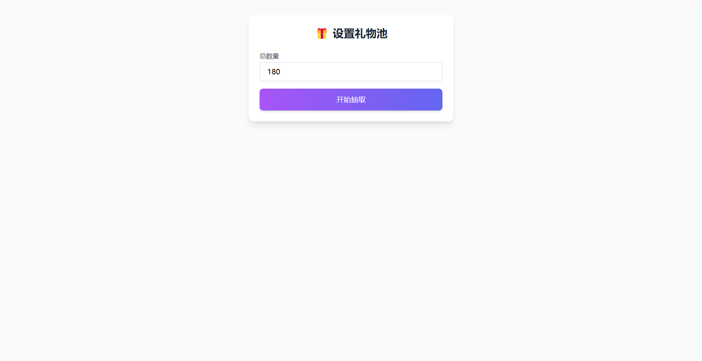
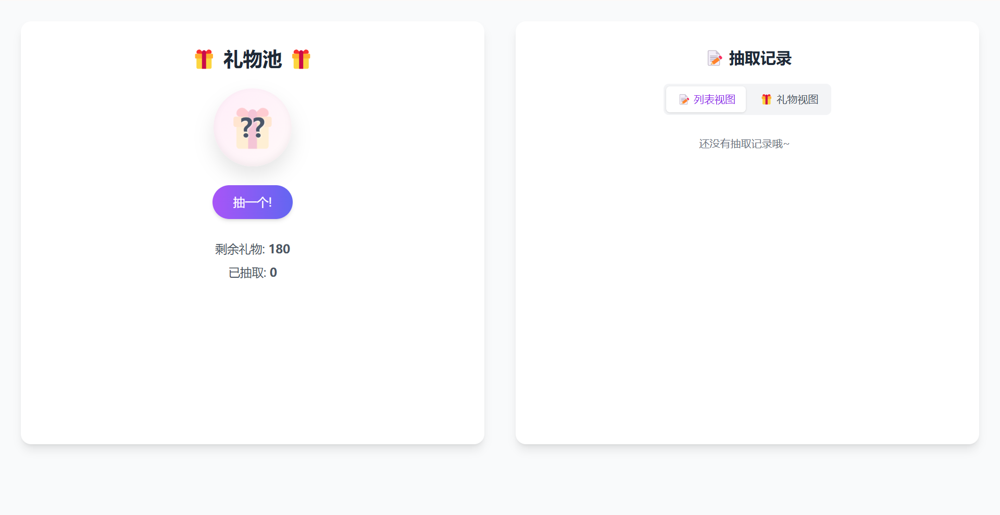
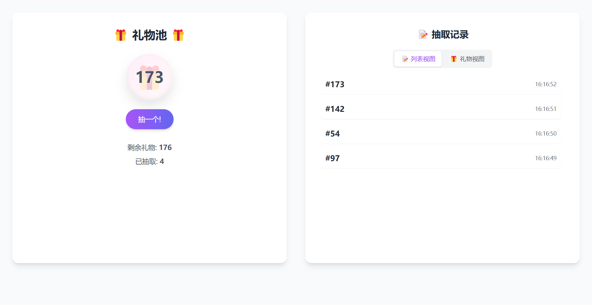
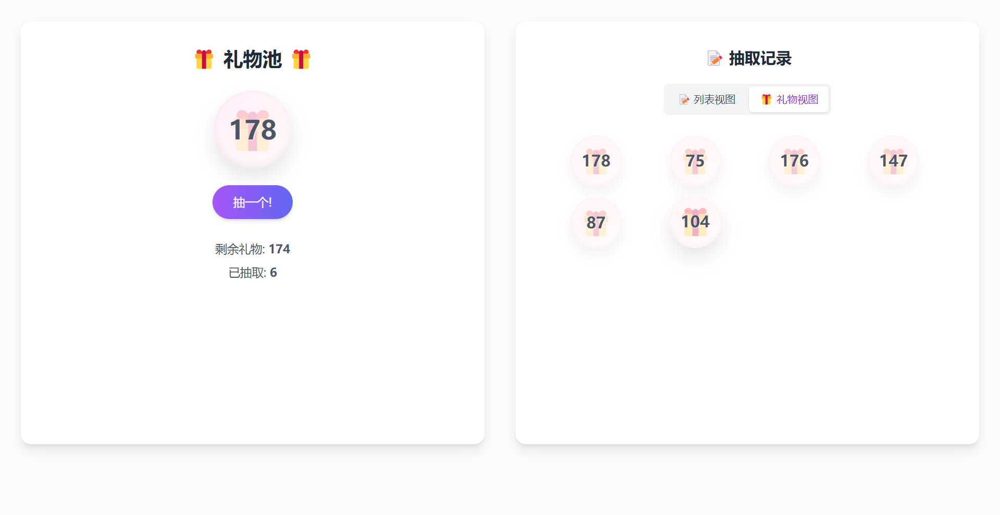

# LuckyGift

一个简单优雅的礼物随机抽取工具，适用于年会抽奖、礼物分配等场景。

## 🌈 在线演示

[点击查看演示](https://zhaomaota.github.io/LuckyGift)

## ✨ 特性

- 🎯 简单易用：无需安装，单文件即可运行
- 🎨 优雅界面：现代化 UI 设计，平滑动画效果
- 📱 响应式：完美支持移动端和桌面端
- 🔄 双视图：支持列表视图和礼物视图
- 🚀 轻量级：无需额外依赖（除 Tailwind CDN）

## 🚀 快速开始

1. 直接在浏览器中打开 `index.html` 文件
2. 输入总数量并开始使用

## 📝 使用场景

- 公司年会抽奖
- 课堂随机点名
- 礼物随机分配
- 号码随机抽取

## 🛠️ 技术栈

- HTML5
- CSS3
- JavaScript
- Tailwind CSS

## 📄 开源协议

MIT License

## 🤝 贡献指南

欢迎提交 Issue 和 Pull Request！
